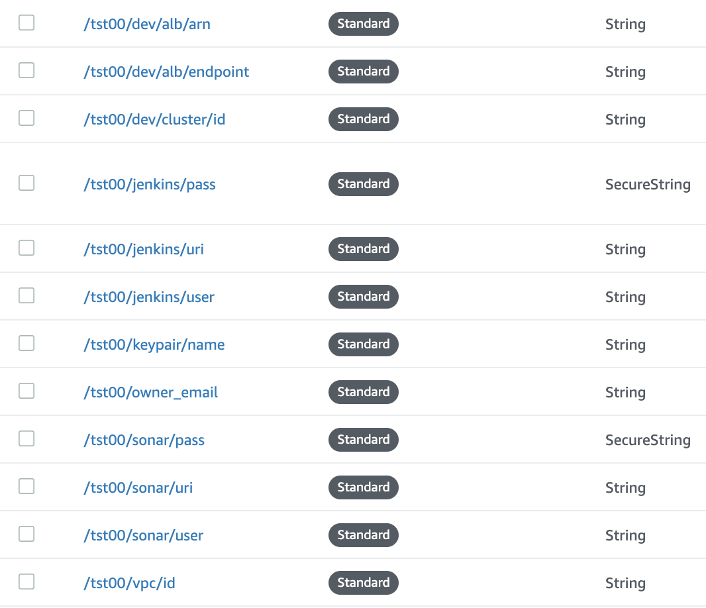

# Glue

This is where you run and manage the services that make up the app, from cloning and updating all related repositories, to starting multiple services able to talk to each other.

You can:

* **Clone all repositories** (in the .repos file). If new ones are added it can be run again: `./git-clone-all`. Get onboarding developers running fast.
* **Start up multiple services**: including core services at once, and specified individual services, all on the same network so they can talk
* **Update/pull all repos**

## Setup

1. Since running multiple continers locally, add more available memory for Docker to handle many services running locally: `Under Docker > Preferences > Advanced` and set the following:
Memory: 4 Gb

1. Clone this repo, and cd into it

1. List the names of your repos in the `./.repos` file (if not generated by xg)

1. Clone all the repos by running `./git-clone-all`

    All of the repos you want to work with will be subdirectories and managed by glue like this:

    ```
    glue
    └── repo 1
    └── repo 2
    ...
    └── repo x
    ```

1. Run the needed command, often initially it would be the core services:

    ```
    ./run core                      # Start main services, including database container

    ./run <SERVICE NAME or ALIAS>   # Run a single server

    ./run db                        # Start just a database

    ./git-pull-all                  # Update all of the managed repos
    ```

# End-to-End Deployment Process
Follow the below steps to deploy an environment into a clean account.

1.  Clone https://github.com/excellaco/tcp-glue then `cd tcp-glue`
1.  Update the `.repos` file with the following:
     ```
     account='https://github.com/excellaco/'  
     repos='
     tcp-ecs
     jenkins
     terraform-aws-jenkins-stack
     terraform-aws-sonar-ecs-fargate
     tcp-java
     tcp-angular
     '
     ```
1. Generate the tcp repos with configuration you fill out:
    1. Fill out all xg configuration files - they are prefixed with `config-`. There is one for ecah tcp repo to be configured and generated.
    1. Execute xg against those config files by running `./xg-go`. The repos should be generated under tcp-glue.
    1. RUN: `./push-glue-auto-tfvars` # this will prefix AWS resources [TODO: Remove, xg handling? Maybe xg should fill this file so we have a reusable terraform vars file] Fill out glue.auto.tfvars
    1. [TODO: add to xg process] RUN: `./update-json-file`
        * This updates the `jenkins/packer/jenkins.json` file with the correct email, region, and source AMI

1. Build the ECS infrastructure:
    1. RUN: `cd tcp-ecs` [3b]
    1. RUN: `docker build -t tcp-ecs:latest -f Docker/Dockerfile .`  [3.3]
        * Ensure current directory is `tcp-ecs`  
        * Estimated time for completion is: `00:02:15`  
    1. RUN: `docker run -it --rm -d --name tcp-ecs -v ~/.aws/credentials:/root/.aws/credentials tcp-ecs:latest`  [3.4]
        * Ensure current directory is tcp-ecs  
        * Ensure ~/.aws/credentials default profile is set (MFA implications)  (to check: `aws sts get-caller-identity` )
        * Follow progress with `docker logs tcp-ecs -f`  
        * Estimated time for completion is: `00:12:30`  
    1. Get the SSH key:
        ```
        docker cp tcp-ecs:/tcp-ecs/keys/ssh .
        mv ssh/*.pub ssh/*.pem .
        ```
        This key will allow you to ssh through the bastion host to any of the instances you'll need to connect to.  Keep it somewhere secure but accessible.

1. Build the Sonar infrastructure:
    1. cd `../terraform-aws-sonar-ecs-fargate`  [4]
    1. RUN: `docker build -t tcp-sonar:latest -f Docker/Dockerfile .`  
        * Ensure current directory is `terraform-aws-sonar-ecs-fargate`  
        * Estimated time for completion is: `00:01:30`  
    1. RUN: `docker run -it --rm -d --name tcp-sonar -v ~/.aws/credentials:/root/.aws/credentials tcp-sonar:latest`  
        * Follow progress with `docker logs tcp-sonar -f`  
        * Estimated time for completion is: `00:03:00`  
        * The "duplicate security group warning" can be ignored.  

1. Build the Jenkins AMI
1. cd `../jenkins`  [5]
    1. RUN: `docker build -t tcp-jenkins-ami:latest -f Docker/Dockerfile .`  
        * Estimated time for completion is: `00:02:30`  
    1. RUN: `docker run -it --rm -d --name tcp-jenkins-ami -v ~/.aws/credentials:/root/.aws/credentials tcp-jenkins-ami:latest`  
        * Estimated time for completion is: `00:20:00`  
        * Note the username and password for Jenkins, found near the beginning of the output

1. Build the Jenkins Infrastructure
    1. `cd ../terraform-aws-jenkins-stack`  
    1. RUN: `docker build -t tcp-jenkins-app:latest -f Docker/Dockerfile .`  
        * Estimated time for completion is: `00:02:00`  
    1. RUN: `docker run -it --rm -d --name tcp-jenkins-app -v ~/.aws/credentials:/root/.aws/credentials tcp-jenkins-app:latest`  
        * Estimated time for completion is: `00:05:00`  
        * Note the app_elb_dns output: this is the URI to use for the Jenkins instance
        * Wait until the EC2 instance is registered and available through the load balancer.  You can determine this by hitting the Jenkins instance in a browser, or by going to the AWS console and viewing the ELB (listed in the `app_elb_id` Terraform output).  It should take no more than a few minutes.

## Misc Notes on Deployment
1. Step 6 (`jenkins-ami`) can be run first, and in parallel with steps 4 (`tcp-ecs`) and 5 (`tcp-sonar`) to save some time.  
1. If you want to integrate Slack and Jenkins, please follow these [steps](https://medium.com/appgambit/integrating-jenkins-with-slack-notifications-4f14d1ce9c7a)  
1. Steps to setup multibranch pipeline jobs can be found [here](https://github.com/excellaco/terraform-aws-jenkins-stack/wiki/Multibranch-Pipeline-Setup)  

## Accessing information
We've leverage SSM parameters to store all vital information, including URIs, and verious credentials.  If you have a question like "What's the Sonar URL?", or "What's the Jenkins Login/Password?", check the SSM parameters in the AWS account.



# End-to-End Destroy Process

Do destroy the entire stack follow the below steps. 

1. Go into the container that has terraform, run: `./go-bash` 
1. cd `terraform-aws-jenkins-stack`  
1. RUN: `./bin/destroy_env` 
1. cd `../terraform-aws-sonar-ecs-fargate`  
1. RUN: `./bin/destroy_env`  
1. cd `../tcp-ecs`  
1. RUN: `./bin/destroy_env`    
1. Stop all running tcp containers  
1. Remove any tcp images  
