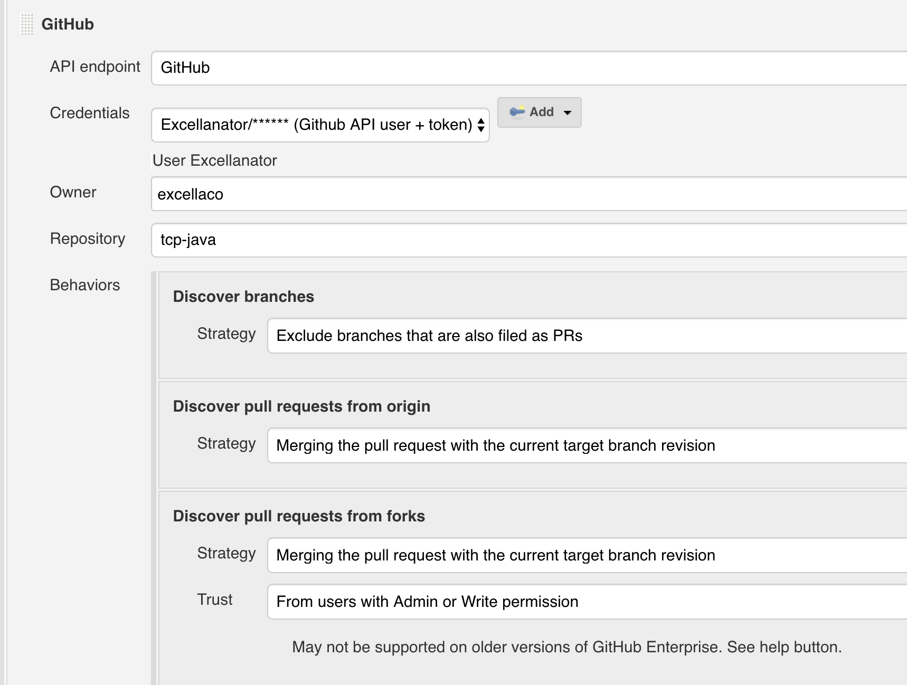
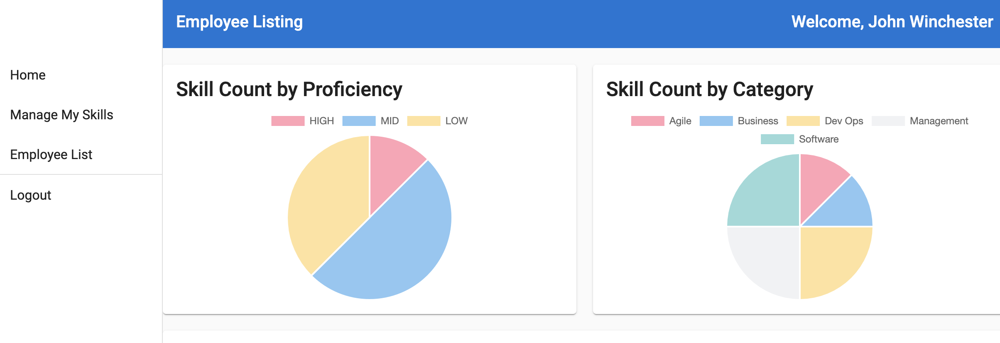
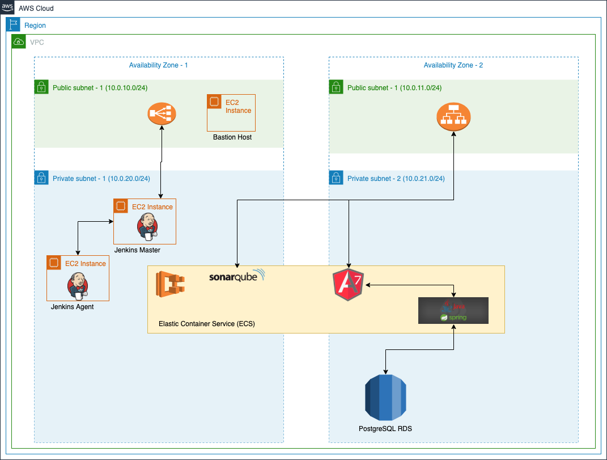

# Tech Challenge Platform - Glue

This is where tcp starts. This is where you can stand up a tech challenge platform - create, run and manage services in addition to pipelines and infrastructure for them. Whether you're starting and want to create a stack, or want to manage the services within your stack, you've come to the right place.

`tcp-glue` provides:

## App and Infrastructure Generation

When you finishing going through the tcp creation process, you'll end up with an app with a front-end, back-end, along with pipelines deploying it into cloud infrastructure.

Follow the process below to get started.

## Local app management

Glue provides enhancements that alleviate pain often experienced when working with multiple repos, including cloning multiple and starting multiple communicating containers together.

* **Clone all repositories** (in the .repos file). If new ones are added it can be run again: `./git-clone-all`. Get onboarding developers running fast.
* **Start up multiple services**: including core services at once, and specified individual services, all on the same network so they can talk
* **Update/pull all repos**

See [local development instructions](#Using-Glue-for–local-development) for more information.

# Getting Started

## Stand up Tech Challenge Platform Infrastructure

In this section you will generate new repos with code for the CI/CD and cloud infrastructure. Then, with them configured as you need, you will stand up the infrastructure from the code.

### Part 1: Prerequisites
There are some required configurations and setup that must be completed before running the platform.
1. GitHub Access
    1. Access to [GitHub](https://github.com/) is required
    1. Membership into the [ExcellaCo GitHub Organization](https://github.com/orgs/excellaco/people) is required.
       * Please request access via `help@excella.com`
    1. Membership in the `tcp-all` ExcellaCo GitHub Team is required.
        * Please request access via [Request to Join Button](https://github.com/orgs/excellaco/teams/tcp-all/members)

1. GitHub and MFA  
    If you have Multi-Factor Authentication (MFA) setup with your GitHub account, you must create a [Personal Access Token](https://help.github.com/en/articles/creating-a-personal-access-token-for-the-command-line), and use the generated token as your `password` for cloning over SSH.  
1. AWS Account Access and Credentials  
    Access to an AWS account is required.  Please contact `help@excella.com` to gain access to the ExcellaLabs account.  Regardless of the account, an `access_key` and `secret_key` are required for programatic access to the environment.   
1. AWS CLI install and Configuration  
    Once access to an AWS account is available, as well as an `access_key` and `secret_key`, the [AWS CLI Tool](https://docs.aws.amazon.com/cli/latest/userguide/cli-chap-install.html) must be installed, and configured by running `aws configure`  
1. Configure the AWS CLI when using MFA [why aren't we just having them use `awsmfa`?]
    Special consideration is required when your AWS account is protected with a MFA device.  To configure the CLI, a `token` is required, which will provide temporary credentials.
    1. Obtain your [MFA ARN through the AWS Console](https://aws.amazon.com/premiumsupport/knowledge-center/authenticate-mfa-cli/).
    1. Run the following command:  
        `aws sts get-session-token --serial-number arn-of-the-mfa-device --token-code code-from-token --duration 129600 --output text`
        * Replace `arn-of-the-mfa-device` with your MFA device ARN.
        * Replace `code-from-token` with the code provided by your MFA device.
    1. Update your `~/.aws/credentials` file with the information from the previous command so it looks like the following:
        ```bash
        [default]
        aws_access_key_id = ASIARKL72BPXXXXXXXXXXXX
        aws_secret_access_key = LqDp3fFerc6NeDYe2wRXXXXXXXXXX
        aws_session_token = FQoGZXIvYXdzEM///////////XXXXXXXXXXX
        ```
    1. As an added measure run `export AWS_PROFILE=default`
    * NOTE: You *must* use the `~/.aws/credentials` file (as opposed to environment variables or a file in a different location), or later steps will fail
1. If you're using xg, download the binary in the repo root from [here](https://github.com/excellaco/xg-release)

### Part 2: Infrastructure

Follow the below steps to deploy the following into a clean account. This will be the foundation. Then you will set up Jenkins pipelines to deploy an app into ECS:

* AWS ECS cluster
* Jenkins AMI & instance
* Sonar instance

1. Generate and configure repos (default includes front-end, API, IaC for Jenkins and ECS. If you're feeling bold you can try the *experimental* approach below this.)
    1. Fork, clone and cd into https://github.com/excellaco/tcp-glue [Why do they need to fork it? They won't be changing tcp-glue.]]
    1. RUN: `./git-clone-all` [3]
    1. RUN: `./make-netrc && ./propagate-netrc`
    1. Fill out `glue.auto.tfvars`
    1. RUN: `./propagate-glue-auto-tfvars` (this will perform some basic checks on the values you provided)
    1. RUN: `./update-json-file`
        * This updates the `jenkins/packer/jenkins.json` file with the correct email, region, and source AMI

    * **(Experimental)** To use xg for the above instead, do the following:

    1. Fill out the `.xg/config-tcp-*.yaml files`. There is one for each service. `projectName` will be the name of the respective repo.
    1. RUN: `./xg-go` to clone and configure the repos

1. Create GitHub repos for each of the newly created repos (if you're feeling bold you can try the *experimental* xg approach below)
    1. Create repos in Github manually
    1. Push the newly created local repos to them
        Scripts to automate it (untested, must do it manually if these don't work)
        1. Update each name in the `.repos` so it has the repo names
        1. Update the remotes for each repo and push by running `./git-set-remotes && ./git-push-all`

    * **(Experimental)** Use [xg publish](https://github.com/excellaco/xg/#publish) instead

1. Build the Jenkins AMI
    1. cd `jenkins`  [5]
    1. RUN: `./go`

      * Estimated time for completion is: `00:22:30`  
      * Note the username and password for Jenkins, found near the beginning of the output  ( if you miss them, they will be available in the ssm_params, see below)
      * This step builds the Jenkins AMI; acutally setting up the Jenkins infrastructure stack is a later step
      * NOTE: You can allow this process to run in the background, and may continue on to the next steps to save time.

1. Build the ECS infrastructure via Terraform
    NOTE: This must complete successfully (cf. "follow progress", below) before Sonar or Jenkins Infrastructure can be run
    1. RUN: `cd ../tcp-ecs` [3b]
    1. RUN: `docker build -t tcp-ecs:latest -f Docker/Dockerfile .`  [3.3]
        * Ensure current directory is `tcp-ecs`  
        * Estimated time for completion is: `00:02:15`  
    1. RUN: `docker run -it --rm -d --name tcp-ecs -v ~/.aws/credentials:/root/.aws/credentials tcp-ecs:latest`  [3.4]
        * Ensure current directory is `tcp-ecs`
        * Ensure `~/.aws/credentials` default profile is set (MFA implications)  (to check: `aws sts get-caller-identity` )
        * Follow progress with `docker logs tcp-ecs -f`  
        * Estimated time for completion is: `00:12:30`  
    1. Get the SSH key:
        ```
        docker cp tcp-ecs:/tcp-ecs/keys/ssh .
        mv ssh/*.pub ssh/*.pem .
        ```
        This key will allow you to ssh through the bastion host to any of the instances you'll need to connect to.  Keep it somewhere secure but accessible.

1. Build the Sonar infrastructure in ECS via Terraform
    1. `cd ../terraform-aws-sonar-ecs-fargate`  [4]
    1. RUN: `docker build -t tcp-sonar:latest -f Docker/Dockerfile .`  
        * Ensure current directory is `terraform-aws-sonar-ecs-fargate`  
        * Estimated time for completion is: `00:01:30`  
    1. RUN: `docker run -it --rm -d --name tcp-sonar -v ~/.aws/credentials:/root/.aws/credentials tcp-sonar:latest`  
        * Follow progress with `docker logs tcp-sonar -f`  
        * Estimated time for completion is: `00:03:00`  
        * The "duplicate security group warning" can be ignored.  

1. Build the Jenkins Infrastructure via Terraform
    NOTE: The "Build the Jenkins AMI" and "Build the ECS Infrastrucutre" steps above must both complete successfully before this step can be run
    1. `cd ../terraform-aws-jenkins-stack`  
    1. RUN: `docker build -t tcp-jenkins-app:latest -f Docker/Dockerfile .`  
        * Estimated time for completion is: `00:02:00`  
    1. RUN: `docker run -it --rm -d --name tcp-jenkins-app -v ~/.aws/credentials:/root/.aws/credentials tcp-jenkins-app:latest`  
        * Estimated time for completion is: `00:05:00`  
        * Note the app_elb_dns output: this is the URI to use for the Jenkins instance
        * Wait until the EC2 instance is registered and available through the load balancer.  You can determine this by hitting the Jenkins instance in a browser, or by going to the AWS console and viewing the ELB (listed in the `app_elb_id` Terraform output).  It should take no more than a few minutes.

#### Misc Notes on Deployment
1. If you want to integrate Slack and Jenkins, please follow these [steps](https://medium.com/appgambit/integrating-jenkins-with-slack-notifications-4f14d1ce9c7a)  
1. Steps to setup multibranch pipeline jobs can be found [here](https://github.com/excellaco/terraform-aws-jenkins-stack/wiki/Multibranch-Pipeline-Setup)  

#### Accessing information
We've leveraged SSM parameters to store all vital information, including URIs, and various credentials.  If you have a question like "What's the Sonar URL?", or "What's the Jenkins Login/Password?", check the SSM parameters in the AWS account.

Parameters are stored in the form `/"project_name"/"env"/"resource"/"attribute"`
  * The env path is only used when applicable
  * In the below references, the Jenkins password for the tst00 project can be found at: `/tst00/jenkins/pass`
  * In the below references, the Development ECS Cluster ID can be found at: `/tst00/dev/cluser/id`


### Part 3: Application Deployment
#### BackEnd - Java
  1. Navigate to the Jenkins instance as defined in the `sss_parameter` /"project_name"/jenkins/uri (username and password can be found at xxxx/jenkins/user and xxxx/jenkins/pass)  
  1. Click on BackEnd -> Java
  1. Click on "New Item" in the Left Tree
  1. Enter the job name, and select "Multibranch Pipeline"
  1. In the "Branch Sources" section select "GitHub"

  

  1. Enter the following information and hit save:

  

  1. Jobs will automatically start, and the Java application will be deployed.  

#### FrontEnd - Angular  
  1. Navigate to the Jenkins instance as defined in the `sss_parameter` /"project_name"/jenkins/uri (username and password can be found at xxxx/jenkins/user and xxxx/jenkins/pass)  
  1. Click on FrontEnd -> AngularFrontEnd
  1. Click on "New Item" in the Left Tree
  1. Enter the job name, and select "Multibranch Pipeline"
  1. In the "Branch Sources" section select "GitHub"

  

  1. Enter the following information and hit save:

  

  1. Jobs will automatically start, and the Angular application will be deployed.  

#### Application Access  
Once the application is successfully deployed, you can access the frontend URL via the sss_parameter under `/"project_name"/dev/alb/endpoint`
 * username: user
 * password: pass

  

### Part 4: Infrastructure Architecture



### Part 4: Teardown

To destroy the entire stack follow the below steps.

1. Go into the `tcp-ecs` directory and run: `./go-conatiner-bash`.

You should be in the container's bash. Do the following:

1. `cd terraform-aws-jenkins-stack`  
1. `./bin/destroy_env`
1. `cd ../terraform-aws-sonar-ecs-fargate`  
1. `./bin/destroy_env`  
1. `cd ../tcp-ecs`  
1. `./bin/destroy_env`    
1. Stop all running tcp containers
1. Remove any tcp images  

# Using Glue for local development

Starting up multiple services across repositories that make up an app, in order to build locally, can be a pain. Glue can help you do that and related things more easily. Among other things, you can build and start the UI, API and a containerized Postgres database, and they will be able to talk to each other.

1. Since running multiple continers locally, add more available memory for Docker to handle many services running locally: `Under Docker > Preferences > Advanced` and set the following:
Memory: 4 Gb

1. Follow any specific setup steps for each conatiner (currently just the JKS setup in https://github.com/excellaco/tcp-java)

1. Build and run the UI, API and database containers locally by running:

    ```./run core```

Additional commands:

```
./run <SERVICE NAME or ALIAS>   # Run a single service

./run db                        # Start just a database

./git-pull-all                  # Pull against all of the managed repos

docker-compse down              # Stop and delete the containers
```

Note, all of the repos you want to work with should be subdirectories of glue like this:

    ```
    glue
    └── repo 1
    └── repo 2
    ...
    └── repo x
    ```
